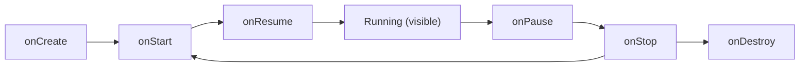
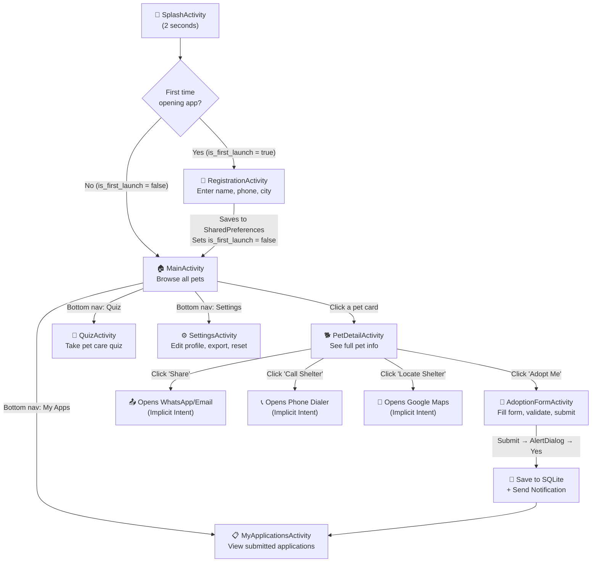

# 🌿 Clover (PawMate) — Complete Project Guide
## Your Zero-to-Hero Android App Walkthrough

---

## Table of Contents

1. [What is This Project?](#1-what-is-this-project)
2. [Android Fundamentals You Need to Know First](#2-android-fundamentals-you-need-to-know-first)
3. [Project Structure Explained](#3-project-structure-explained)
4. [How the App Flows — Screen by Screen](#4-how-the-app-flows)
5. [Deep Dive: Every Java File Explained](#5-deep-dive-every-java-file-explained)
6. [Deep Dive: Every XML Layout Explained](#6-deep-dive-every-xml-layout-explained)
7. [Deep Dive: Resources (Colors, Strings, Drawables, Themes)](#7-deep-dive-resources)
8. [Core Concepts Explained with Code](#8-core-concepts-explained-with-code)
9. [Database (SQLite) — Full Breakdown](#9-database-sqlite)
10. [How All 8 Practicals Map to This App](#10-practical-mapping)

---

## 1. What is This Project?

**Clover** (originally called PawMate) is an **Android pet adoption app** built entirely in **Java**. It lets users:

- Browse a list of pets (dogs, cats, birds, rabbits)
- View detailed info about each pet
- Submit adoption applications with a form
- Take a pet care quiz
- Share pet info via WhatsApp/Email
- Call the shelter or find it on a map
- Export an adoption certificate to a file
- Manage their profile and settings

> [!IMPORTANT]
> The app is **100% offline** — it uses **SQLite** (a local database stored on your phone) and **SharedPreferences** (key-value storage). No internet needed.

**Tech Stack:**
| Technology | Purpose |
|---|---|
| Java | Programming language for all logic |
| XML | Designing the UI (layouts) |
| SQLite | Local database to store pets & applications |
| SharedPreferences | Storing small data like user name, phone |
| Android SDK (API 24-36) | The Android platform itself |
| Gradle (Kotlin DSL) | Build system that compiles everything |

---

## 2. Android Fundamentals You Need to Know First

### 2.1 — What is an Activity?

An **Activity** is one screen in your app. Each screen you see (Splash, Registration, Home, etc.) is a separate Activity. Every Activity is a Java class that extends `AppCompatActivity`.

```
Activity = One Screen = One Java Class + One XML Layout
```

When you open the app, it starts `SplashActivity`. From there, it can open `RegistrationActivity` or `MainActivity`, and so on.

### 2.2 — What is a Layout (XML)?

Every Activity needs to show something on screen. The **layout XML file** defines WHAT is shown — buttons, text, input fields, etc. Think of it as the **blueprint of the screen**.

The Java code then says WHAT HAPPENS when you click a button, type something, etc.

```
XML = How it LOOKS
Java = What it DOES
```

### 2.3 — What is `setContentView()`?

This line connects a Java Activity to its XML layout:

```java
setContentView(R.layout.activity_splash);
```

This says: "Load the XML file `activity_splash.xml` and show it on the screen."

### 2.4 — What is `findViewById()`?

Every element in your XML has an `id`. To use that element in Java, you "find" it by its ID:

```java
EditText etName = findViewById(R.id.etRegName);
```

This says: "Find the EditText whose `android:id` is `@+id/etRegName` in the XML, and give me a reference to it so I can read/write its value."

### 2.5 — What is `R`?

`R` is an auto-generated class that maps every resource (layouts, IDs, colors, strings, drawables) to an integer. When you write `R.layout.activity_splash`, Android knows exactly which XML file you mean. You never edit `R` — it's generated automatically from your `res/` folder.

### 2.6 — What is the Activity Lifecycle?

Every Activity goes through stages:



| Method | When it runs |
|---|---|
| `onCreate()` | Activity is being created for the first time. Initialize everything here |
| `onStart()` | Activity is becoming visible |
| `onResume()` | Activity is now in the foreground and interactive |
| `onPause()` | Another activity is coming to the foreground |
| `onStop()` | Activity is no longer visible |
| `onDestroy()` | Activity is being destroyed |
| `onRestart()` | Activity is restarting after being stopped |

### 2.7 — What is an Intent?

An **Intent** is a message that tells Android to do something. There are two types:

| Type | What it does | Example |
|---|---|---|
| **Explicit Intent** | Opens a specific Activity in YOUR app | `new Intent(this, PetDetailActivity.class)` |
| **Implicit Intent** | Asks the SYSTEM to do something (open browser, dial phone, share text) | `new Intent(Intent.ACTION_DIAL, Uri.parse("tel:123"))` |

### 2.8 — What is a Toast?

A short popup message that appears at the bottom of the screen for a few seconds:

```java
Toast.makeText(this, "Hello!", Toast.LENGTH_SHORT).show();
```

### 2.9 — What are Android Layouts?

Layouts are containers that arrange child elements on screen:

| Layout | How it arranges children |
|---|---|
| **LinearLayout** | In a single line — either `vertical` (top to bottom) or `horizontal` (left to right) |
| **RelativeLayout** | Relative to each other or the parent (e.g., "below this", "right of that") |
| **ConstraintLayout** | Most flexible — constrain each element to edges of parent or siblings |
| **ScrollView** | Wraps content that can be scrolled if it's taller than the screen |

---

## 3. Project Structure Explained

```
Clover/
├── app/
│   ├── build.gradle.kts          ← Build config (dependencies, SDK versions)
│   └── src/main/
│       ├── AndroidManifest.xml   ← Registers all activities, permissions
│       ├── java/com/example/clover/
│       │   ├── SplashActivity.java          ← Splash screen (2-sec delay)
│       │   ├── RegistrationActivity.java    ← First-time user setup
│       │   ├── MainActivity.java            ← Home — browse pets
│       │   ├── PetDetailActivity.java       ← View one pet's details
│       │   ├── AdoptionFormActivity.java    ← Fill adoption form
│       │   ├── MyApplicationsActivity.java  ← View submitted applications
│       │   ├── QuizActivity.java            ← Pet care quiz
│       │   ├── SettingsActivity.java        ← Profile & data management
│       │   ├── DatabaseHelper.java          ← SQLite database logic
│       │   ├── Pet.java                     ← Data model for a pet
│       │   └── AdoptionApplication.java     ← Data model for an application
│       └── res/
│           ├── layout/           ← XML files (one per screen + item layouts)
│           ├── drawable/         ← Shape XMLs for buttons, cards, backgrounds
│           ├── values/
│           │   ├── colors.xml    ← All color definitions
│           │   ├── strings.xml   ← All text strings & arrays
│           │   └── themes.xml    ← App theme (colors, styles)
│           └── mipmap-*/         ← App icon in multiple resolutions
├── build.gradle.kts              ← Root build file
├── settings.gradle.kts           ← Project settings
└── prd.md                        ← Product Requirements Document
```

### 3.1 — AndroidManifest.xml

This is the **ID card of your app**. It tells Android:

1. **What permission the app needs**: `POST_NOTIFICATIONS` — to send notifications
2. **What Activities exist**: Every Activity MUST be registered here or Android won't know it exists
3. **Which Activity starts first**: The one with `MAIN` action and `LAUNCHER` category = SplashActivity
4. **App metadata**: Name, icon, theme, backup rules

```xml
<activity android:name=".SplashActivity" android:exported="true"
    android:theme="@style/Theme.Clover.Splash">
    <intent-filter>
        <action android:name="android.intent.action.MAIN" />
        <category android:name="android.intent.category.LAUNCHER" />
    </intent-filter>
</activity>
```

The `intent-filter` with `MAIN` + `LAUNCHER` is what makes this the app's entry point (the icon on your home screen).

### 3.2 — build.gradle.kts (App Level)

This defines:

```kotlin
namespace = "com.example.clover"  // Unique identifier
minSdk = 24                       // Minimum Android 7.0
targetSdk = 36                    // Built for latest Android
```

**Dependencies** — libraries the app uses:

| Dependency | What it provides |
|---|---|
| `appcompat` | Backward-compatible Activity, AlertDialog, etc. |
| `material` | Material Design components |
| `constraintlayout` | ConstraintLayout view |
| `activity` | Modern Activity APIs |

---

## 4. How the App Flows



---

## 5. Deep Dive: Every Java File Explained

---

### 5.1 — Pet.java (Model Class)

**What is a Model Class?** A model is a plain Java class that represents ONE thing — in this case, one pet. It holds data and provides getter/setter methods to access that data.

**What it stores:** id, name, type (Dog/Cat/Bird/Rabbit), breed, age, size, temperament, description, emoji, and whether it's adopted.

```java
public class Pet {
    private long id;
    private String name, type, breed, age, size, temperament, description, emoji;
    private boolean isAdopted;
```

**Constructor** — creates a Pet object with all values at once:

```java
public Pet(long id, String name, String type, String breed, String age, String size,
           String temperament, String description, String emoji, boolean isAdopted) {
    this.id = id; this.name = name; // ... etc
}
```

**Getter methods** — let other classes READ the data:

```java
public String getName() { return name; }
public boolean isAdopted() { return isAdopted; }
```

**Setter methods** — let other classes WRITE the data:

```java
public void setName(String name) { this.name = name; }
```

> [!TIP]
> The `this` keyword differentiates the class variable (`this.name`) from the method parameter (`name`). Without `this`, Java wouldn't know which `name` you mean.

---

### 5.2 — AdoptionApplication.java (Model Class)

Same concept as `Pet.java` but for an adoption application. Stores: id, petId, petName, adopterName, phone, address, housingType, hasOtherPets, experience, reason, date, status.

It only has a default constructor (no-argument) and getter/setter methods. Objects of this class are created by setting each field individually:

```java
AdoptionApplication app = new AdoptionApplication();
app.setPetId(petId);
app.setPetName(petName);
app.setAdopterName("Rahul");
```

---

### 5.3 — SplashActivity.java

**Purpose:** Shows a branded splash screen for 2 seconds, then decides where to go next.

**Key concepts covered:**
- Activity Lifecycle (all 7 methods)
- SharedPreferences (reading data)
- Handler with postDelayed (timed action)
- Explicit Intent (navigating to another activity)

**Line-by-line breakdown:**

```java
private static final String TAG = "CloverLifecycle";
```
A `TAG` is a label used for logging. When you look at Logcat (Android's log viewer), you filter by this tag to see only YOUR messages.

```java
Log.d(TAG, "SplashActivity: onCreate()");
```
`Log.d()` = "Log a Debug message." This prints to Logcat so you can see when each lifecycle method is called. `d` stands for debug — there's also `Log.e()` for errors, `Log.w()` for warnings.

```java
setContentView(R.layout.activity_splash);
```
Loads the splash screen XML layout.

```java
new Handler().postDelayed(() -> {
    // code here runs after 2000 milliseconds (2 seconds)
}, 2000);
```
**Handler** is an Android class that can schedule code to run after a delay. `postDelayed(Runnable, delay)` says "run this code after `delay` milliseconds."

The `() -> { ... }` is a **lambda expression** (shortcut for writing an anonymous inner class). It's equivalent to:
```java
new Runnable() {
    @Override
    public void run() {
        // code here
    }
}
```

```java
SharedPreferences prefs = getSharedPreferences("CloverPrefs", MODE_PRIVATE);
boolean first = prefs.getBoolean("is_first_launch", true);
```
**SharedPreferences** is Android's key-value storage (like a dictionary). `"CloverPrefs"` is the file name. `MODE_PRIVATE` means only this app can access it.

`getBoolean("is_first_launch", true)` means: "Get the value of `is_first_launch`. If it doesn't exist yet, return `true` as default."

```java
startActivity(new Intent(this, first ? RegistrationActivity.class : MainActivity.class));
```
This is a **ternary operator**: `condition ? valueIfTrue : valueIfFalse`.

If `first` is `true` → open RegistrationActivity.
If `first` is `false` → open MainActivity.

`this` refers to the current Activity (SplashActivity).

```java
finish();
```
Destroys SplashActivity so the user can't press "Back" and return to it.

**Lifecycle methods at the bottom:**
```java
@Override protected void onStart() { super.onStart(); Log.d(TAG, "SplashActivity: onStart()"); }
```
Each lifecycle method calls `super.onXxx()` first (mandatory — tells Android to do its internal work), then logs a message.

---

### 5.4 — RegistrationActivity.java

**Purpose:** First-time setup. Collects user's name, phone, city, and pet preference. Saves to SharedPreferences so the app remembers.

**Key concepts:**
- EditText (text input)
- Spinner (dropdown menu)
- Input validation (checking if data is correct)
- SharedPreferences (writing data)
- Toast (popup message)

**Breakdown:**

```java
EditText etName = findViewById(R.id.etRegName);
Spinner spinnerPref = findViewById(R.id.spinnerPref);
```
Gets references to UI elements defined in the XML layout.

```java
findViewById(R.id.btnGetStarted).setOnClickListener(v -> {
```
**`setOnClickListener`** — attaches a function that runs when the button is clicked. The `v` is the View that was clicked (the button itself).

**Input Validation:**
```java
if (name.isEmpty()) { 
    etName.setError("Enter your name"); 
    etName.requestFocus(); 
    return; 
}
```
- `isEmpty()` — checks if the string is empty
- `setError("...")` — shows a red error message on the EditText
- `requestFocus()` — puts the cursor in that field
- `return;` — stops execution here, doesn't continue to save

```java
if (phone.isEmpty() || phone.length() != 10) {
```
`||` means OR. So if phone is empty OR not exactly 10 digits, show error.

**Saving to SharedPreferences:**
```java
SharedPreferences.Editor editor = getSharedPreferences("CloverPrefs", MODE_PRIVATE).edit();
editor.putBoolean("is_first_launch", false);
editor.putString("user_name", name);
editor.apply();
```
- `.edit()` — opens SharedPreferences for writing
- `.putBoolean()` / `.putString()` — saves a key-value pair
- `.apply()` — commits the changes (works in background)

```java
spinnerPref.getSelectedItem().toString()
```
Gets whatever the user selected from the Spinner dropdown.

After saving, it shows a Toast, starts MainActivity, and calls `finish()` to close RegistrationActivity.

---

### 5.5 — MainActivity.java

**Purpose:** The home screen. Shows a welcome header, stats bar (available pets count, applications count), a filter dropdown, and a scrollable list of pet cards.

**Key concepts:**
- ConstraintLayout + LinearLayout + RelativeLayout (all 3 layouts used)
- SQLite reading (SELECT queries)
- Dynamic UI creation (inflating layouts in a loop)
- Spinner with listener
- Explicit Intents (opening detail screen)
- Lifecycle methods

**Breakdown:**

```java
private DatabaseHelper db;
private LinearLayout petList;
```
`db` is the database helper (explained later). `petList` is the container where pet cards will be added dynamically.

```java
db = new DatabaseHelper(this);
```
Creates an instance of the database. The first time this runs, it creates the database file and pre-loads 10 pets.

```java
tvUserName.setText(prefs.getString("user_name", "User"));
```
Gets the user's name from SharedPreferences and displays it. If not found, shows "User".

**Spinner (Filter dropdown):**
```java
spinnerFilter.setOnItemSelectedListener(new AdapterView.OnItemSelectedListener() {
    @Override public void onItemSelected(AdapterView<?> p, View v, int pos, long id) { 
        loadPets(p.getItemAtPosition(pos).toString()); 
    }
    @Override public void onNothingSelected(AdapterView<?> p) { 
        loadPets("All"); 
    }
});
```
This listens for spinner selection changes. When the user picks "Dog", `pos` would be 1, and `getItemAtPosition(1)` returns "Dog". Then `loadPets("Dog")` is called.

**Bottom Navigation:**
```java
findViewById(R.id.navHome).setOnClickListener(v -> {});
```
Home button does nothing (empty lambda) since we're already on the Home screen.

```java
findViewById(R.id.navApps).setOnClickListener(v -> 
    startActivity(new Intent(this, MyApplicationsActivity.class)));
```
Opens MyApplicationsActivity via Explicit Intent.

**onResume:**
```java
@Override
protected void onResume() {
    super.onResume();
    tvPetCount.setText(String.valueOf(db.getAvailableCount()));
    tvAppCount.setText(String.valueOf(db.getApplicationCount()));
    loadPets(filter);
}
```
`onResume()` runs every time the screen becomes visible (including coming back from another screen). This refreshes the pet count and list to reflect any changes.

**loadPets() — The Heart of the Home Screen:**
```java
List<Pet> pets = filter.equals("All") ? db.getAllPets() : db.getPetsByType(filter);
```
If filter is "All", get all pets. Otherwise, filter by type.

```java
petList.removeAllViews();
```
Clears existing pet cards before adding new ones (prevents duplicates).

```java
View item = LayoutInflater.from(this).inflate(R.layout.item_pet_card, petList, false);
```
**LayoutInflater** converts an XML layout file into an actual View object in memory. `item_pet_card.xml` defines what one card looks like. We create one card per pet.

```java
((TextView) item.findViewById(R.id.tvPetEmoji)).setText(pet.getEmoji());
```
Find the emoji TextView INSIDE the card (`item.findViewById`, not just `findViewById`), then set its text to the pet's emoji.

The `(TextView)` at the start is **casting** — `findViewById` returns a generic `View`, and we need to tell Java it's specifically a `TextView` so we can call `.setText()`.

```java
item.setOnClickListener(v -> {
    Intent intent = new Intent(this, PetDetailActivity.class);
    intent.putExtra("pet_id", pet.getId());
    startActivity(intent);
});
```
When a card is clicked, open PetDetailActivity and send the pet's ID along. `putExtra()` attaches data to the Intent — like putting a note inside an envelope.

```java
petList.addView(item);
```
Adds the card to the LinearLayout container, making it visible on screen.

---

### 5.6 — PetDetailActivity.java

**Purpose:** Shows detailed info about one pet. Offers buttons to adopt, share, call shelter, and locate shelter.

**Key concepts:**
- Receiving data via Intent extras
- Explicit Intent (to AdoptionFormActivity)
- Implicit Intents (Share, Dial, Map)
- Conditionally enabling/disabling buttons

**Breakdown:**

```java
long petId = getIntent().getLongExtra("pet_id", -1);
```
**Receiving data:** `getIntent()` gets the Intent that started this Activity. `getLongExtra("pet_id", -1)` gets the pet_id that was attached. `-1` is the default if the key doesn't exist (error case).

```java
if (petId == -1) { finish(); return; }
```
Safety check: If no valid pet ID was sent, close this screen.

```java
Pet pet = db.getPetById(petId);
```
Query the database to get the full Pet object.

**Disabling adopt button for already-adopted pets:**
```java
if (pet.isAdopted()) {
    btnAdopt.setEnabled(false);
    btnAdopt.setText("Already Adopted");
    btnAdopt.setBackgroundResource(R.drawable.btn_disabled);
}
```
`setEnabled(false)` makes the button unclickable. `setBackgroundResource()` changes its appearance to look grey/disabled.

**Implicit Intent — Share:**
```java
Intent share = new Intent(Intent.ACTION_SEND);
share.setType("text/plain");
share.putExtra(Intent.EXTRA_TEXT, text);
startActivity(Intent.createChooser(share, "Share via"));
```
- `ACTION_SEND` tells Android "I want to send something"
- `setType("text/plain")` specifies the data type
- `EXTRA_TEXT` is the actual text to share
- `createChooser()` shows a popup letting the user pick WhatsApp, Email, etc.

**Implicit Intent — Call Shelter:**
```java
startActivity(new Intent(Intent.ACTION_DIAL, Uri.parse(getString(R.string.shelter_phone))));
```
- `ACTION_DIAL` opens the phone dialer (doesn't make the call — just puts in the number)
- `Uri.parse("tel:1800456789")` creates a phone URI
- `getString(R.string.shelter_phone)` gets the phone number from strings.xml

**Implicit Intent — Locate Shelter:**
```java
Intent map = new Intent(Intent.ACTION_VIEW, Uri.parse("geo:0,0?q=animal+shelter+near+me"));
```
- `ACTION_VIEW` tells Android to view something
- The `geo:` URI opens Google Maps with a search for "animal shelter near me"

---

### 5.7 — AdoptionFormActivity.java

**Purpose:** Lets the user fill out an adoption application. Validates all fields. Shows a confirmation dialog. Saves to SQLite database. Sends a notification.

**Key concepts:**
- TextWatcher (watching text changes in real-time)
- RadioGroup & RadioButton (selecting options)
- Button enable/disable based on validation
- AlertDialog (confirmation popup)
- SQLite INSERT
- Notification with PendingIntent
- NotificationChannel (required for Android 8+)

**This is the most concept-heavy Activity!**

**TextWatcher — watching user typing in real-time:**
```java
TextWatcher watcher = new TextWatcher() {
    @Override public void beforeTextChanged(CharSequence s, int a, int b, int c) {}
    @Override public void onTextChanged(CharSequence s, int a, int b, int c) {}
    @Override public void afterTextChanged(Editable s) { validateForm(); }
};
etName.addTextChangedListener(watcher);
```
A `TextWatcher` gets called every time the user types/deletes a character. We only care about `afterTextChanged` — after the text has changed, run `validateForm()`.

The same watcher is attached to ALL text fields, and the RadioGroups also call `validateForm()` when selection changes:

```java
rgHousing.setOnCheckedChangeListener((g, id) -> validateForm());
```

**Form Validation:**
```java
private void validateForm() {
    boolean valid = !etName.getText().toString().trim().isEmpty()
            && etPhone.getText().toString().trim().length() == 10
            && !etAddress.getText().toString().trim().isEmpty()
            && rgHousing.getCheckedRadioButtonId() != -1
            && rgOtherPets.getCheckedRadioButtonId() != -1
            && etReason.getText().toString().trim().length() >= 10;

    btnSubmit.setEnabled(valid);
    btnSubmit.setBackgroundResource(valid ? R.drawable.btn_primary : R.drawable.btn_disabled);
}
```
- `.trim()` removes leading/trailing spaces
- `getCheckedRadioButtonId() != -1` means "at least one radio button is selected" (returns -1 if none selected)
- The submit button is enabled ONLY when ALL conditions are true

**AlertDialog:**
```java
new AlertDialog.Builder(this)
    .setTitle(getString(R.string.dialog_confirm_title))
    .setMessage(String.format(getString(R.string.dialog_confirm_msg), petName))
    .setIcon(android.R.drawable.ic_dialog_info)
    .setPositiveButton(R.string.yes, (d, w) -> submitApplication())
    .setNegativeButton(R.string.cancel, (d, w) -> d.dismiss())
    .show();
```
- `AlertDialog.Builder` creates a popup dialog
- `.setPositiveButton()` = the "Yes" button → calls `submitApplication()`
- `.setNegativeButton()` = the "Cancel" button → dismisses (closes) the dialog
- `String.format()` replaces `%1$s` in the string with `petName`

**Submitting to SQLite:**
```java
AdoptionApplication app = new AdoptionApplication();
app.setPetId(petId);
app.setPetName(petName);
// ... set all fields ...

long id = db.insertApplication(app);
if (id > 0) {
    db.markAdopted(petId);
    Toast.makeText(this, getString(R.string.toast_submitted), Toast.LENGTH_SHORT).show();
    sendNotification();
    finish();
}
```
Creates an `AdoptionApplication` object, fills it with form data, inserts into SQLite. If successful (`id > 0`), marks the pet as adopted, shows a toast, sends a notification, and closes the screen.

**Getting selected RadioButton text:**
```java
RadioButton rbHousing = findViewById(rgHousing.getCheckedRadioButtonId());
app.setHousingType(rbHousing.getText().toString());
```
`getCheckedRadioButtonId()` returns the ID of the selected radio button. We then find that RadioButton and get its text ("Apartment", "House", or "Farm").

**Notification:**
```java
private void sendNotification() {
    Intent intent = new Intent(this, MyApplicationsActivity.class);
    intent.setFlags(Intent.FLAG_ACTIVITY_NEW_TASK | Intent.FLAG_ACTIVITY_CLEAR_TASK);
    PendingIntent pi = PendingIntent.getActivity(this, 0, intent, 
        PendingIntent.FLAG_UPDATE_CURRENT | PendingIntent.FLAG_IMMUTABLE);
```
- **PendingIntent** = an Intent that runs LATER when the user taps the notification
- `FLAG_IMMUTABLE` = the PendingIntent can't be changed after creation (required for Android 12+)

```java
    NotificationCompat.Builder builder = new NotificationCompat.Builder(this, CH_ID)
        .setSmallIcon(android.R.drawable.ic_dialog_email)
        .setContentTitle(getString(R.string.notif_submitted_title))
        .setContentText(String.format(getString(R.string.notif_submitted_text), petName))
        .setPriority(NotificationCompat.PRIORITY_HIGH)
        .setContentIntent(pi)
        .setAutoCancel(true);
```
Builds the notification:
- `setSmallIcon()` = the small icon in the status bar
- `setAutoCancel(true)` = notification disappears when tapped

```java
    ((NotificationManager) getSystemService(NOTIFICATION_SERVICE)).notify(1, builder.build());
```
Sends the notification. `1` is the notification ID (used to update or cancel it later).

**NotificationChannel (Required for Android 8+ / API 26+):**
```java
private void createNotificationChannel() {
    if (Build.VERSION.SDK_INT >= Build.VERSION_CODES.O) {
        NotificationChannel ch = new NotificationChannel(CH_ID, "Adoption Alerts", 
            NotificationManager.IMPORTANCE_HIGH);
        ch.setDescription("Notifications for adoption applications");
        ((NotificationManager) getSystemService(NOTIFICATION_SERVICE)).createNotificationChannel(ch);
    }
}
```
Android 8+ requires notifications to belong to a "channel" — a category the user can control (mute, change priority).

---

### 5.8 — MyApplicationsActivity.java

**Purpose:** Shows all submitted adoption applications. Lets users withdraw (delete) applications.

**Key concepts:**
- SQLite SELECT (reading all applications)
- Dynamic list UI (inflating items)
- AlertDialog for confirmation
- SQLite DELETE
- Switch-case for status coloring

**Status coloring:**
```java
switch (app.getStatus()) {
    case "Pending":
        tvStatus.setTextColor(getResources().getColor(R.color.pending_amber));
        break;
    case "Approved":
        tvStatus.setTextColor(getResources().getColor(R.color.adopted_green));
        break;
    default:
        tvStatus.setTextColor(getResources().getColor(R.color.rejected_red));
}
```
Changes the text color based on application status.

**Withdraw with AlertDialog:**
When the user clicks the withdraw (✕) button, a confirmation dialog appears. On "Yes", the application is deleted from SQLite and the list refreshes by calling `loadApplications()` again.

---

### 5.9 — QuizActivity.java

**Purpose:** A 5-question pet care quiz with RadioButtons. Shows score after submission. Sends a notification with the result.

**Key concepts:**
- Multiple RadioGroups
- Checking which RadioButton is selected
- Calculating score
- SharedPreferences (saving high score)
- Showing/hiding views dynamically
- Notification with PendingIntent

**Checking answers:**
```java
int score = 0;
if (rgQ1.getCheckedRadioButtonId() == R.id.rbQ1A) score++;  // Daily
if (rgQ2.getCheckedRadioButtonId() == R.id.rbQ2A) score++;  // Chocolate
if (rgQ3.getCheckedRadioButtonId() == R.id.rbQ3B) score++;  // 8 years
if (rgQ4.getCheckedRadioButtonId() == R.id.rbQ4A) score++;  // Daily
if (rgQ5.getCheckedRadioButtonId() == R.id.rbQ5A) score++;  // Rabies
```
Each `if` checks if the selected RadioButton matches the correct answer.

**Showing the score card:**
```java
findViewById(R.id.scoreCard).setVisibility(View.VISIBLE);
```
The score card is initially `GONE` (invisible and takes no space). Setting it to `VISIBLE` makes it appear.

---

### 5.10 — SettingsActivity.java

**Purpose:** Edit profile, export adoption certificate, share report, reset all data.

**Key concepts:**
- SharedPreferences (read + write)
- Internal Storage (writing a file)
- Implicit Intent (sharing text)
- AlertDialog (reset confirmation)
- SQLite (delete all data + re-seed)

**Exporting to Internal Storage:**
```java
FileOutputStream fos = openFileOutput("clover_certificate.txt", Context.MODE_PRIVATE);
fos.write(sb.toString().getBytes());
fos.close();
```
- `openFileOutput()` creates/opens a file in the app's private internal storage
- `MODE_PRIVATE` means only this app can read the file
- StringBuilder (`sb`) builds the certificate text, then `.getBytes()` converts it to bytes for writing

**Reset All Data:**
```java
db.deleteAll();
prefs.edit().clear().putBoolean("is_first_launch", true).apply();
```
- `deleteAll()` deletes all applications and pets from SQLite, then re-seeds the 10 sample pets
- `.clear()` erases everything in SharedPreferences
- `.putBoolean("is_first_launch", true)` ensures the registration screen shows again
- After resetting, it restarts the app from SplashActivity

---

### 5.11 — DatabaseHelper.java

**Purpose:** The central database class. Handles EVERYTHING related to SQLite — creating tables, seeding data, and all CRUD (Create, Read, Update, Delete) operations.

This is explained in detail in [Section 9](#9-database-sqlite).

---

## 6. Deep Dive: Every XML Layout Explained

### 6.1 — activity_splash.xml

**Layout type:** ConstraintLayout

Contains 4 TextViews centered on screen:
1. **Paw icon (🐾)** — inside a white rounded card
2. **"Clover"** — large white bold text
3. **"Find Your Furry Friend 🐾"** — tagline in light color
4. **"v1.0"** — version number at the bottom

The three main elements form a **vertical chain** (`packed` style) — they're grouped together and centered vertically.

**Background:** `@drawable/splash_bg` — an orange gradient (from `#FF6B35` to `#D4521E` at 135° angle).

### 6.2 — activity_registration.xml

**Layout type:** ScrollView → LinearLayout (vertical, centered)

A scrollable form with:
- Paw emoji in an orange circle
- Title and subtitle
- A white card containing nested LinearLayouts for each field:
  - Name (EditText)
  - Phone (EditText with `inputType="phone"`)
  - City (EditText)
  - Pet Preference (Spinner dropdown)
- "Get Started" button

### 6.3 — activity_main.xml

**Layout type:** ConstraintLayout (outer) containing multiple child layouts

Structure from top to bottom:
1. **Header** (LinearLayout) — orange background, white welcome text + user name
2. **Stats Bar** (LinearLayout with 2 RelativeLayouts) — shows "Available Pets" count and "My Applications" count
3. **Filter Row** (LinearLayout) — "Filter:" label + Spinner dropdown
4. **Pet List** (ScrollView → LinearLayout) — pet cards get added here dynamically
5. **Empty state** (TextView) — shown when no pets match filter
6. **Bottom Nav** (LinearLayout with 4 TextViews) — Home, My Apps, Quiz, Settings

> [!NOTE]
> The Stats Bar uses `RelativeLayout` for each stat card. Inside each, the count text is positioned `below` the label using `android:layout_below="@id/labelAvail"`. This is how RelativeLayout works — child views position relative to siblings.

### 6.4 — item_pet_card.xml

**Layout type:** LinearLayout (horizontal)

One single pet card — used as a template and inflated multiple times in a loop:
- **Emoji** (50×50dp, centered)
- **Info column** (name, breed, age + size)
- **Status badge** ("Available" or "Adopted ✓")

### 6.5 — activity_pet_detail.xml

**Layout type:** ScrollView → ConstraintLayout

- **Hero card** — large emoji, pet name, breed
- **Info card** — rows showing Type, Age, Size, Temperament, Description
- **Action Buttons** — Adopt Me!, Share, Call Shelter, Locate Shelter

### 6.6 — activity_adoption_form.xml

**Layout type:** ScrollView → ConstraintLayout

- **Adopting card** — shows which pet you're adopting (emoji + name)
- **Form card** — Name, Phone, Address, Housing Type (RadioGroup), Other Pets (RadioGroup), Experience (Spinner), Reason (multi-line EditText)
- **Submit button** — starts `disabled` (grey), becomes enabled (orange) when form is valid

### 6.7 — activity_my_applications.xml

**Layout type:** ConstraintLayout

- Title "My Applications"
- ScrollView with LinearLayout container for application items
- Empty state text (shown when no applications)

### 6.8 — item_application.xml

**Layout type:** LinearLayout (horizontal)

One application card:
- Pet emoji (44×44dp)
- Pet name + date
- Status text (color-coded) + Withdraw button (red ✕)

### 6.9 — activity_quiz.xml

**Layout type:** ScrollView → LinearLayout (vertical)

- Title + subtitle
- 5 question cards (each a LinearLayout with question text + RadioGroup with 3 options)
- Score card (hidden until quiz is submitted)
- Submit Quiz button

### 6.10 — activity_settings.xml

**Layout type:** ScrollView → LinearLayout (vertical)

- **Profile section** — Name, Phone, City EditTexts + Save button
- **Data Management section** — Export Certificate, Share Report, Reset All Data

---

## 7. Deep Dive: Resources

### 7.1 — colors.xml

Defines all colors used everywhere. Instead of writing `#FF6B35` directly in XML, you write `@color/primary`. This makes it easy to change colors app-wide.

| Color Name | Hex | Used For |
|---|---|---|
| `primary` | `#FF6B35` | Orange — app bar, buttons, accents |
| `primary_dark` | `#D4521E` | Darker orange — status bar |
| `primary_light` | `#FFE0CC` | Light peach — subtle tints |
| `accent` | `#00BFA5` | Teal — secondary actions |
| `adopted_green` | `#66BB6A` | "Adopted" status |
| `pending_amber` | `#FFA726` | "Pending" status |
| `rejected_red` | `#EF5350` | Rejected + Withdraw + Reset |
| `background` | `#FFF8F0` | Warm cream — full page background |
| `card_white` | `#FFFFFF` | White — card backgrounds |
| `text_primary` | `#3E2723` | Dark brown — main text |
| `text_secondary` | `#8D6E63` | Warm grey — subtitles |
| `text_hint` | `#BCAAA4` | Very light — placeholder text |
| `disabled` | `#BDBDBD` | Grey — disabled buttons |

### 7.2 — strings.xml

All text shown in the app is defined here — not hardcoded in layouts or Java. This is a best practice for:
- Easy text changes (change once, updates everywhere)
- Supports translations (add `values-hi/strings.xml` for Hindi, etc.)

It also defines **string arrays** used by Spinners:
- `pet_preferences`: Any, Dog, Cat, Bird, Rabbit
- `filter_types`: All, Dog, Cat, Bird, Rabbit
- `experience_levels`: First-time Owner, Experienced, Professional

**Format strings with placeholders:**
```xml
<string name="dialog_confirm_msg">Are you sure you want to submit this adoption application for %1$s?</string>
```
`%1$s` gets replaced at runtime using `String.format()`:
```java
String.format(getString(R.string.dialog_confirm_msg), petName)
```

### 7.3 — themes.xml

Defines the visual theme applied to the entire app:

```xml
<style name="Base.Theme.Clover" parent="Theme.Material3.DayNight.NoActionBar">
    <item name="colorPrimary">@color/primary</item>
    <item name="colorPrimaryDark">@color/primary_dark</item>
    <item name="colorAccent">@color/accent</item>
    <item name="android:windowBackground">@color/background</item>
    <item name="android:statusBarColor">@color/primary_dark</item>
</style>
```

- `NoActionBar` = no default toolbar (the app creates its own header)
- `colorPrimary` = the main color used by system-styled widgets
- `android:statusBarColor` = the bar at the very top showing time/battery

There's a special `Theme.Clover.Splash` that makes the splash screen have an orange background.

### 7.4 — Drawables (Shape XMLs)

**btn_primary.xml** — Orange rounded rectangle for buttons:
```xml
<shape android:shape="rectangle">
    <solid android:color="@color/primary" />
    <corners android:radius="12dp" />
</shape>
```

**btn_accent.xml** — Same but teal (`@color/accent`)

**btn_disabled.xml** — Same but grey (`@color/disabled`)

**card_bg.xml** — White rounded rectangle for cards (16dp corners)

**circle_bg.xml** — Orange circle (for the paw icon on registration)

**splash_bg.xml** — Gradient background:
```xml
<gradient android:startColor="#FF6B35" android:endColor="#D4521E" android:angle="135" />
```
Starts orange, ends dark orange, at a 135° angle (diagonal).

---

## 8. Core Concepts Explained with Code

### 8.1 — SharedPreferences (Persistent Key-Value Storage)

**Purpose:** Store small pieces of data that survive app restarts.

**Writing:**
```java
SharedPreferences.Editor editor = getSharedPreferences("CloverPrefs", MODE_PRIVATE).edit();
editor.putString("user_name", "Rahul");
editor.putBoolean("is_first_launch", false);
editor.putInt("quiz_high_score", 5);
editor.apply();
```

**Reading:**
```java
SharedPreferences prefs = getSharedPreferences("CloverPrefs", MODE_PRIVATE);
String name = prefs.getString("user_name", "Default");
boolean first = prefs.getBoolean("is_first_launch", true);
int score = prefs.getInt("quiz_high_score", 0);
```

The second argument is always the **default value** if the key doesn't exist.

**Clearing:**
```java
prefs.edit().clear().apply();
```

### 8.2 — Explicit Intents (Navigate Between YOUR Screens)

```java
Intent intent = new Intent(this, PetDetailActivity.class);
intent.putExtra("pet_id", 5L);
intent.putExtra("pet_name", "Buddy");
startActivity(intent);
```

**Receiving in the target Activity:**
```java
long petId = getIntent().getLongExtra("pet_id", -1);
String name = getIntent().getStringExtra("pet_name");
```

### 8.3 — Implicit Intents (Ask the System to Do Something)

| Action | Code |
|---|---|
| **Share text** | `new Intent(Intent.ACTION_SEND)` + `setType("text/plain")` + `putExtra(EXTRA_TEXT, text)` |
| **Open dialer** | `new Intent(Intent.ACTION_DIAL, Uri.parse("tel:123"))` |
| **Open maps** | `new Intent(Intent.ACTION_VIEW, Uri.parse("geo:0,0?q=..."))` |

### 8.4 — AlertDialog (Confirmation Popup)

```java
new AlertDialog.Builder(this)
    .setTitle("Confirm")
    .setMessage("Are you sure?")
    .setIcon(android.R.drawable.ic_dialog_alert)
    .setPositiveButton("Yes", (dialog, which) -> { /* do something */ })
    .setNegativeButton("Cancel", (dialog, which) -> dialog.dismiss())
    .show();
```

### 8.5 — Notifications

**Step 1 — Create channel (once, in `onCreate`):**
```java
if (Build.VERSION.SDK_INT >= Build.VERSION_CODES.O) {
    NotificationChannel ch = new NotificationChannel("channel_id", "Channel Name", 
        NotificationManager.IMPORTANCE_HIGH);
    getSystemService(NotificationManager.class).createNotificationChannel(ch);
}
```

**Step 2 — Create PendingIntent (what happens when notification is tapped):**
```java
Intent intent = new Intent(this, SomeActivity.class);
PendingIntent pi = PendingIntent.getActivity(this, 0, intent, 
    PendingIntent.FLAG_UPDATE_CURRENT | PendingIntent.FLAG_IMMUTABLE);
```

**Step 3 — Build and send:**
```java
NotificationCompat.Builder builder = new NotificationCompat.Builder(this, "channel_id")
    .setSmallIcon(android.R.drawable.ic_dialog_info)
    .setContentTitle("Title")
    .setContentText("Body text")
    .setContentIntent(pi)
    .setAutoCancel(true);

((NotificationManager) getSystemService(NOTIFICATION_SERVICE)).notify(1, builder.build());
```

### 8.6 — Internal Storage (Writing Files)

```java
FileOutputStream fos = openFileOutput("filename.txt", Context.MODE_PRIVATE);
fos.write("Hello World".getBytes());
fos.close();
```
The file is stored in `/data/data/com.example.clover/files/filename.txt` — completely private to the app.

### 8.7 — RadioGroup & RadioButton

**XML:**
```xml
<RadioGroup android:id="@+id/rgHousing" android:orientation="horizontal">
    <RadioButton android:id="@+id/rbApartment" android:text="Apartment" />
    <RadioButton android:id="@+id/rbHouse" android:text="House" />
    <RadioButton android:id="@+id/rbFarm" android:text="Farm" />
</RadioGroup>
```

**Java — Check if anything is selected:**
```java
if (rgHousing.getCheckedRadioButtonId() == -1) {
    // Nothing selected
}
```

**Java — Get selected text:**
```java
RadioButton rb = findViewById(rgHousing.getCheckedRadioButtonId());
String selected = rb.getText().toString(); // "Apartment", "House", or "Farm"
```

**Java — Listen for selection changes:**
```java
rgHousing.setOnCheckedChangeListener((group, checkedId) -> {
    // checkedId is the ID of the newly selected RadioButton
});
```

### 8.8 — TextWatcher (Real-Time Input Monitoring)

```java
editText.addTextChangedListener(new TextWatcher() {
    @Override public void beforeTextChanged(CharSequence s, int start, int count, int after) {}
    @Override public void onTextChanged(CharSequence s, int start, int before, int count) {}
    @Override public void afterTextChanged(Editable s) {
        // Runs every time the text changes — use for validation
    }
});
```

### 8.9 — Spinner (Dropdown Menu)

**XML:**
```xml
<Spinner android:id="@+id/spinner" android:entries="@array/filter_types" />
```
`entries` auto-populates from the string array in strings.xml.

**Java — Get selected value:**
```java
String selected = spinner.getSelectedItem().toString();
```

**Java — Listen for selection:**
```java
spinner.setOnItemSelectedListener(new AdapterView.OnItemSelectedListener() {
    @Override public void onItemSelected(AdapterView<?> parent, View view, int pos, long id) {
        String value = parent.getItemAtPosition(pos).toString();
    }
    @Override public void onNothingSelected(AdapterView<?> parent) {}
});
```

---

## 9. Database (SQLite)

### 9.1 — What is SQLite?

SQLite is a **lightweight database** that lives as a single file on the device. No server needed. Android has built-in support via `SQLiteOpenHelper`.

### 9.2 — DatabaseHelper.java — Full Breakdown

**Extending SQLiteOpenHelper:**
```java
public class DatabaseHelper extends SQLiteOpenHelper {
    private static final String DB_NAME = "clover.db";
    private static final int DB_VERSION = 1;

    public DatabaseHelper(Context context) { 
        super(context, DB_NAME, null, DB_VERSION); 
    }
```
- `DB_NAME` — the database file name
- `DB_VERSION` — increment this when you change the schema (triggers `onUpgrade`)

### 9.3 — Creating Tables (onCreate)

```java
@Override
public void onCreate(SQLiteDatabase db) {
    db.execSQL("CREATE TABLE pets (_id INTEGER PRIMARY KEY AUTOINCREMENT, ...)");
    db.execSQL("CREATE TABLE applications (_id INTEGER PRIMARY KEY AUTOINCREMENT, ...)");
    seedPets(db);
}
```
`onCreate()` runs ONCE — when the database is created for the first time. It creates both tables and seeds 10 sample pets.

**Pets Table:**

| Column | Type | Meaning |
|---|---|---|
| `_id` | INTEGER PRIMARY KEY AUTOINCREMENT | Unique ID, auto-increments |
| `name` | TEXT NOT NULL | Pet name (e.g., "Buddy") |
| `type` | TEXT NOT NULL | Dog/Cat/Bird/Rabbit |
| `breed` | TEXT NOT NULL | Breed (e.g., "Golden Retriever") |
| `age` | TEXT NOT NULL | Age (e.g., "2 years") |
| `size` | TEXT NOT NULL | Small/Medium/Large |
| `temperament` | TEXT NOT NULL | Personality traits |
| `description` | TEXT NOT NULL | Full description |
| `emoji` | TEXT NOT NULL | Emoji icon (🐕, 🐈, etc.) |
| `is_adopted` | INTEGER DEFAULT 0 | 0 = available, 1 = adopted |

**Applications Table:**

| Column | Type | Meaning |
|---|---|---|
| `_id` | INTEGER PRIMARY KEY AUTOINCREMENT | Unique ID |
| `pet_id` | INTEGER NOT NULL | FK — which pet |
| `pet_name` | TEXT NOT NULL | Pet name |
| `adopter_name` | TEXT NOT NULL | User's name |
| `phone` | TEXT NOT NULL | User's phone |
| `address` | TEXT NOT NULL | User's address |
| `housing_type` | TEXT NOT NULL | Apartment/House/Farm |
| `has_other_pets` | TEXT NOT NULL | Yes/No |
| `experience` | TEXT NOT NULL | First-time/Experienced/Professional |
| `reason` | TEXT NOT NULL | Why they want to adopt |
| `date` | TEXT NOT NULL | Date of submission |
| `status` | TEXT DEFAULT 'Pending' | Pending/Approved/Rejected |

### 9.4 — Seeding Data

```java
private void seedPets(SQLiteDatabase db) {
    insertPet(db, "Buddy", "Dog", "Golden Retriever", "2 years", "Large", 
        "Friendly, Playful", "A lovable Golden Retriever...", "🐕");
    // ... 9 more pets
}
```

### 9.5 — CRUD Operations

**CREATE (Insert):**
```java
public long insertApplication(AdoptionApplication a) {
    SQLiteDatabase db = getWritableDatabase();
    ContentValues v = new ContentValues();
    v.put("pet_id", a.getPetId());
    v.put("pet_name", a.getPetName());
    // ... all fields ...
    long id = db.insert("applications", null, v);
    db.close();
    return id;
}
```
- `getWritableDatabase()` — opens the database for writing
- `ContentValues` — a map of column→value pairs
- `db.insert()` returns the new row's ID (or -1 if error)
- Always `db.close()` when done

**READ (Select All):**
```java
public List<Pet> getAllPets() { 
    return queryPets("SELECT * FROM pets ORDER BY is_adopted ASC, _id ASC", null); 
}
```
`ORDER BY is_adopted ASC` puts available pets (0) before adopted pets (1).

**READ (Select with Filter):**
```java
public List<Pet> getPetsByType(String type) { 
    return queryPets("SELECT * FROM pets WHERE type = ? ORDER BY is_adopted ASC", new String[]{type}); 
}
```
The `?` is a placeholder replaced by the value in the string array. This prevents SQL injection.

**READ (Select by ID):**
```java
public Pet getPetById(long id) {
    SQLiteDatabase db = getReadableDatabase();
    Cursor c = db.rawQuery("SELECT * FROM pets WHERE _id = ?", new String[]{String.valueOf(id)});
    Pet p = null;
    if (c.moveToFirst()) p = cursorToPet(c);
    c.close(); db.close();
    return p;
}
```
A **Cursor** is like a pointer that goes through the result rows. `moveToFirst()` moves to the first row. If no rows, it returns false.

**READ (Count):**
```java
public int getAvailableCount() {
    Cursor c = db.rawQuery("SELECT COUNT(*) FROM pets WHERE is_adopted = 0", null);
    int count = 0; 
    if (c.moveToFirst()) count = c.getInt(0);
    c.close(); db.close();
    return count;
}
```
`COUNT(*)` counts matching rows. `c.getInt(0)` gets the first column of the result (the count).

**UPDATE:**
```java
public void markAdopted(long petId) {
    SQLiteDatabase db = getWritableDatabase();
    ContentValues v = new ContentValues();
    v.put("is_adopted", 1);
    db.update("pets", v, "_id = ?", new String[]{String.valueOf(petId)});
    db.close();
}
```
`db.update(table, values, whereClause, whereArgs)` — updates rows matching the WHERE clause.

**DELETE:**
```java
public void deleteApplication(long id) {
    SQLiteDatabase db = getWritableDatabase();
    db.delete("applications", "_id = ?", new String[]{String.valueOf(id)});
    db.close();
}
```

**DELETE ALL + RESEED:**
```java
public void deleteAll() {
    SQLiteDatabase db = getWritableDatabase();
    db.delete("applications", null, null);
    db.delete("pets", null, null);
    seedPets(db);
    db.close();
}
```
Deletes all rows from both tables, then re-inserts the 10 sample pets.

### 9.6 — Cursor to Object Conversion

```java
private Pet cursorToPet(Cursor c) {
    return new Pet(c.getLong(0), c.getString(1), c.getString(2), c.getString(3),
            c.getString(4), c.getString(5), c.getString(6), c.getString(7), 
            c.getString(8), c.getInt(9) == 1);
}
```
The Cursor holds the raw row data. `c.getString(0)` gets column 0, `c.getString(1)` gets column 1, etc. `c.getInt(9) == 1` converts the integer 0/1 to a boolean (0=false, 1=true).

---

## 10. How All 8 Practicals Map to This App

| # | Practical | Where in the App | Files |
|---|---|---|---|
| **P1** | GUI, Fonts, Colors, Activity Lifecycle | Warm color theme, lifecycle logging in SplashActivity + MainActivity | `SplashActivity.java`, `MainActivity.java`, `colors.xml`, `themes.xml` |
| **P2** | Nested LinearLayout, RelativeLayout, ConstraintLayout | Home screen uses all 3: ConstraintLayout (outer), LinearLayout (header, pet list), RelativeLayout (stat cards) | `activity_main.xml`, `activity_registration.xml` |
| **P3** | Event Handlers, Button Enable/Disable, Toast | Adoption form — submit button starts disabled, enables when all fields valid. Toast on success | `AdoptionFormActivity.java` |
| **P4** | ConstraintLayout, Input Validation, Form Management | Adoption form layout uses ConstraintLayout. Name, phone (10 digits), address, reason (10+ chars) validated | `AdoptionFormActivity.java`, `RegistrationActivity.java` |
| **P5** | Explicit + Implicit Intents | **Explicit:** Home→Detail→Form. **Implicit:** Share (ACTION_SEND), Call (ACTION_DIAL), Map (ACTION_VIEW with geo: URI) | `PetDetailActivity.java`, `MainActivity.java` |
| **P6** | RadioButtons, AlertDialog, Notifications, PendingIntent | Housing type + Other pets are RadioGroups. Confirm dialog before submission. Notification with PendingIntent after submit. Quiz uses all 4 | `AdoptionFormActivity.java`, `QuizActivity.java`, `MyApplicationsActivity.java` |
| **P7** | SharedPreferences, Internal Storage | User profile saved in SharedPrefs (skips registration on relaunch). Adoption certificate exported to internal file storage | `RegistrationActivity.java`, `SplashActivity.java`, `SettingsActivity.java` |
| **P8** | SQLite Database (CRUD) | Two tables: `pets` + `applications`. INSERT (submit form), SELECT (browse pets, view apps), UPDATE (mark adopted), DELETE (withdraw app, reset) | `DatabaseHelper.java`, `MainActivity.java`, `AdoptionFormActivity.java`, `MyApplicationsActivity.java` |

---

> [!IMPORTANT]
> **Key Takeaway:** This app is structured around 8 lab practicals, but it's a real, functional app. Every screen demonstrates specific Android concepts. The data flows like this:
> 
> **SharedPreferences** → stores user profile (small data)
> **SQLite Database** → stores pets and applications (structured data)
> **Internal Storage** → stores the exported certificate (file)
> **Intents** → navigate between screens and interact with the operating system

---

*🌿 Generated for the Clover (PawMate) project — SL-II Lab*
