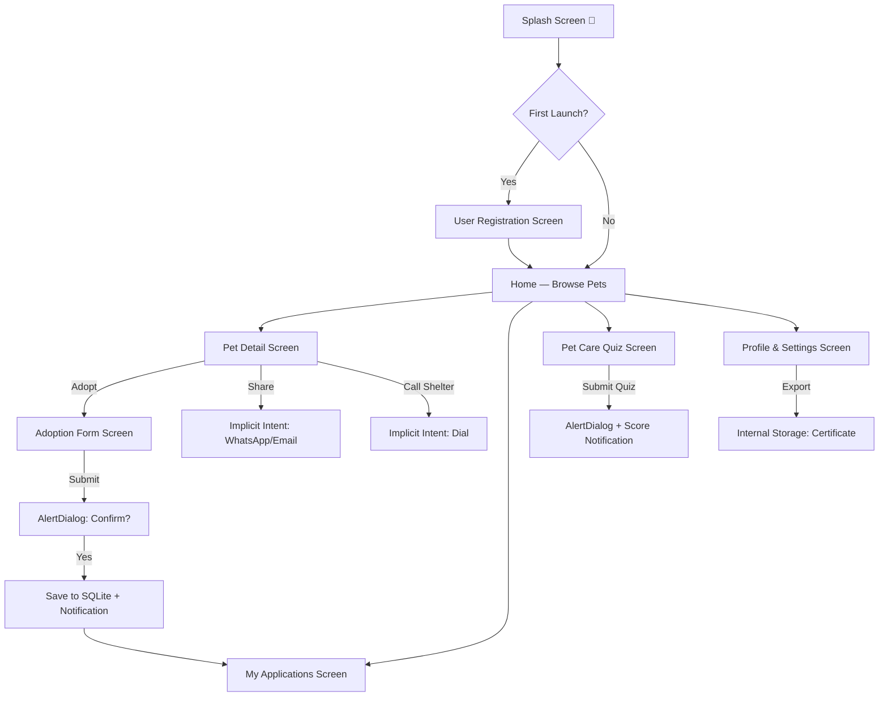

# 📄 Product Requirements Document (PRD)
# **PawMate — Pet Adoption & Care App** 🐾

---

## 1. Overview

| Field | Detail |
|-------|--------|
| **App Name** | PawMate |
| **Platform** | Android (Java) |
| **Min SDK** | 24 (Android 7.0) |
| **Target SDK** | 36 |
| **Package** | `com.example.pawmate` |
| **Purpose** | A pet adoption platform where users can browse available pets, register to adopt, track adoption applications, and get pet care tips — all offline |

---

## 2. Problem Statement

Animal shelters struggle to connect pets with potential adopters. PawMate bridges this gap by providing an intuitive mobile app where users can browse available pets, submit adoption applications with proper validation, share pet profiles with friends, and manage their adoption journey — all without needing internet access.

---

## 3. Target Users

- Students & families looking to adopt a pet
- Animal lovers wanting to browse adoptable pets
- Shelter volunteers managing adoption forms

---

## 4. Concept-to-Practical Mapping

> [!IMPORTANT]
> Every feature is built using **only** concepts from the 8 SL-II practicals.

| Practical # | Concept | How It's Used in PawMate |
|:-----------:|---------|--------------------------|
| **P1** | GUI Components, Fonts, Colors, Activity Lifecycle | Custom animal-themed UI with warm colors. Lifecycle logging on all screens |
| **P2** | Nested LinearLayout, RelativeLayout, ConstraintLayout | Pet cards (RelativeLayout), Browse list (Nested LinearLayout), Adoption form (ConstraintLayout) |
| **P3** | Event Handlers, Button Enable/Disable, Toast | "Submit Adoption" button disabled until all fields valid. Toast on successful submission |
| **P4** | ConstraintLayout, Input Validation, Form Management | Adoption form: Name, Phone, Address, Pet preference validation |
| **P5** | Explicit & Implicit Intents | Explicit: Browse → Pet Detail → Adoption Form. Implicit: Share pet on WhatsApp, Call shelter, Open map to shelter location |
| **P6** | RadioButtons, AlertDialog, Notifications, PendingIntent | Pet size preference (RadioButtons). "Confirm adoption?" dialog. "Your application is approved!" notification |
| **P7** | SharedPreferences, Internal Storage | First-time user profile setup (skip on relaunch). Save shelter preference. Export adoption certificate to file |
| **P8** | SQLite Database (CRUD) | Store pet listings, adoption applications. View/filter/delete applications |

---

## 5. App Architecture — Screen Flow



---

## 6. Detailed Screen Specifications

### 6.1 — Splash Screen
| Aspect | Detail |
|--------|--------|
| **Layout** | ConstraintLayout |
| **Practical** | P1 (Lifecycle), P2 (Layout) |
| **Components** | Paw icon 🐾, "PawMate" title, tagline "Find Your Furry Friend", version |
| **Behavior** | Shows for 2 seconds → checks SharedPrefs → routes to Registration (first) or Home |
| **Lifecycle Demo** | All 7 lifecycle methods logged to Logcat |

### 6.2 — User Registration Screen (First Launch Only)
| Aspect | Detail |
|--------|--------|
| **Layout** | Nested LinearLayout |
| **Practical** | P2 (Nested Layout), P7 (SharedPreferences) |
| **Fields** | Full Name (EditText), Phone (EditText), City (EditText), Pet Preference (Spinner: Dog, Cat, Bird, Rabbit, Any) |
| **Behavior** | On "Get Started" → save to SharedPreferences → never show again |
| **Validation** | P4: Name & phone must not be empty, phone must be 10 digits |

### 6.3 — Home — Browse Pets (MainActivity)
| Aspect | Detail |
|--------|--------|
| **Layout** | ConstraintLayout (outer) + Nested LinearLayout (cards) |
| **Practical** | P1 (GUI), P2 (All 3 layouts), P8 (SQLite) |
| **Components** | |
| | **Header**: Welcome message + user name from SharedPrefs |
| | **Stats Bar**: Available pets count, My applications count (from SQLite) |
| | **Pet Cards**: ScrollView with pet listing cards. Each card = RelativeLayout with pet emoji, name, breed, age, status |
| | **Bottom Nav**: Home, My Apps, Quiz, Settings |
| **Data** | Pets are pre-loaded into SQLite on first launch (8-10 sample pets) |
| **Filter** | Spinner at top to filter by type (All, Dog, Cat, Bird, Rabbit) |

### 6.4 — Pet Detail Screen
| Aspect | Detail |
|--------|--------|
| **Layout** | ConstraintLayout |
| **Practical** | P5 (Intents), P2 (Layout) |
| **Display** | Large pet emoji, Name, Breed, Age, Size, Temperament, Description, Shelter info |
| **Actions** | |
| | **"Adopt Me" Button** → Explicit Intent to Adoption Form (P5) |
| | **"Share" Button** → Implicit Intent: ACTION_SEND to WhatsApp/Email (P5) |
| | **"Call Shelter" Button** → Implicit Intent: ACTION_DIAL (P5) |
| | **"Locate Shelter" Button** → Implicit Intent: ACTION_VIEW with geo: URI (P5) |

### 6.5 — Adoption Form Screen
| Aspect | Detail |
|--------|--------|
| **Layout** | ConstraintLayout |
| **Practical** | P3 (Event Handlers), P4 (Validation), P6 (RadioButtons, AlertDialog, Notification) |
| **Fields** | |
| | **Adopter Name** — EditText (pre-filled from SharedPrefs) |
| | **Phone** — EditText (10-digit validation) |
| | **Address** — EditText (must not be empty) |
| | **Housing Type** — RadioGroup: Apartment / House / Farm (P6) |
| | **Has Other Pets** — RadioGroup: Yes / No (P6) |
| | **Experience** — Spinner: First-time / Experienced / Professional |
| | **Why adopt?** — EditText (reason, min 10 chars) |
| **"Submit" Button** | P3: Initially **disabled**. Enabled only when ALL fields valid. TextWatcher on every field |
| **On Submit** | P6: AlertDialog "Are you sure you want to submit this adoption application?" → Yes: INSERT into SQLite (P8), send Notification "🐾 Application submitted!" with PendingIntent to My Applications |

### 6.6 — My Applications Screen
| Aspect | Detail |
|--------|--------|
| **Layout** | ConstraintLayout + LinearLayout (list) |
| **Practical** | P5 (Explicit Intent), P6 (AlertDialog), P8 (SQLite SELECT/DELETE) |
| **Components** | Scrollable list of submitted applications |
| **Each Row** | Pet emoji, pet name, date submitted, status (Pending/Approved/Rejected) |
| **Actions** | |
| | Click row → view full application details (P5: Explicit Intent) |
| | Long press / Delete button → AlertDialog: "Withdraw this application?" → DELETE from SQLite (P8) |

### 6.7 — Pet Care Quiz Screen
| Aspect | Detail |
|--------|--------|
| **Layout** | LinearLayout (Nested) |
| **Practical** | P6 (RadioButtons, AlertDialog, Notification, PendingIntent) |
| **Content** | 5 multiple-choice pet care questions with RadioButtons |
| **Questions** (example) | |
| | Q1: How often should you walk a dog? (Daily / Weekly / Monthly) |
| | Q2: Which food is toxic to cats? (Chocolate / Chicken / Rice) |
| | Q3: What's the average lifespan of a rabbit? (2yr / 8yr / 20yr) |
| | Q4: How often should you clean a bird cage? (Daily / Weekly / Monthly) |
| | Q5: What vaccination is essential for puppies? (Rabies / Flu / None) |
| **"Submit Quiz" Button** | P6: AlertDialog "Are you sure you want to submit?" → Yes/Cancel |
| **On Yes** | Calculate score → Notification: "🏆 Your pet care quiz result is ready!" with PendingIntent opening result screen |
| **Result** | Display score, correct answers, pet care tips |

### 6.8 — Profile & Settings Screen
| Aspect | Detail |
|--------|--------|
| **Layout** | LinearLayout |
| **Practical** | P5 (Implicit Intent), P6 (AlertDialog), P7 (SharedPrefs + Internal Storage), P8 (SQLite) |
| **Sections** | |
| | **Profile Card**: Edit name, phone, city (SharedPreferences) |
| | **Export Certificate**: Generate adoption certificate → save to Internal Storage (P7) |
| | **Share Certificate**: Implicit Intent → share via WhatsApp/Email (P5) |
| | **Reset All Data**: AlertDialog confirmation → clear SQLite + SharedPrefs (P6, P7, P8) |

---

## 7. Database Schema (SQLite — P8)

### Table: `pets`
| Column | Type | Constraints |
|--------|------|-------------|
| `_id` | INTEGER | PRIMARY KEY AUTOINCREMENT |
| `name` | TEXT | NOT NULL |
| `type` | TEXT | NOT NULL (Dog/Cat/Bird/Rabbit) |
| `breed` | TEXT | NOT NULL |
| `age` | TEXT | NOT NULL |
| `size` | TEXT | NOT NULL (Small/Medium/Large) |
| `temperament` | TEXT | NOT NULL |
| `description` | TEXT | NOT NULL |
| `emoji` | TEXT | NOT NULL |
| `is_adopted` | INTEGER | DEFAULT 0 |

### Table: `applications`
| Column | Type | Constraints |
|--------|------|-------------|
| `_id` | INTEGER | PRIMARY KEY AUTOINCREMENT |
| `pet_id` | INTEGER | NOT NULL (FK to pets) |
| `pet_name` | TEXT | NOT NULL |
| `adopter_name` | TEXT | NOT NULL |
| `phone` | TEXT | NOT NULL |
| `address` | TEXT | NOT NULL |
| `housing_type` | TEXT | NOT NULL |
| `has_other_pets` | TEXT | NOT NULL |
| `experience` | TEXT | NOT NULL |
| `reason` | TEXT | NOT NULL |
| `date` | TEXT | NOT NULL |
| `status` | TEXT | DEFAULT 'Pending' |

### Sample Pet Data (Pre-loaded)
```
1. 🐕 Buddy     | Dog    | Golden Retriever | 2 years  | Large  | Friendly, Playful
2. 🐈 Whiskers  | Cat    | Persian          | 1 year   | Medium | Calm, Affectionate
3. 🐦 Tweety    | Bird   | Cockatiel        | 6 months | Small  | Chirpy, Social
4. 🐇 Snowball  | Rabbit | Holland Lop      | 8 months | Small  | Gentle, Curious
5. 🐕 Rocky     | Dog    | German Shepherd  | 3 years  | Large  | Loyal, Protective
6. 🐈 Luna      | Cat    | Siamese          | 2 years  | Medium | Elegant, Vocal
7. 🐦 Mango     | Bird   | Parrot           | 1 year   | Medium | Talkative, Colorful
8. 🐇 Coco      | Rabbit | Mini Rex         | 4 months | Small  | Playful, Soft
9. 🐕 Daisy     | Dog    | Beagle           | 1 year   | Medium | Energetic, Friendly
10. 🐈 Shadow   | Cat    | Black Cat        | 3 years  | Medium | Independent, Mysterious
```

---

## 8. SharedPreferences Keys (P7)

| Key | Type | Purpose |
|-----|------|---------|
| `is_first_launch` | boolean | Skip registration after first setup |
| `user_name` | String | Display on home header |
| `user_phone` | String | Pre-fill adoption forms |
| `user_city` | String | Location preference |
| `pet_preference` | String | Filter preference |
| `quiz_high_score` | int | Best quiz score |

---

## 9. File Structure (Java Classes)

```
com.example.pawmate/
├── SplashActivity.java           — Splash + lifecycle demo (P1)
├── RegistrationActivity.java     — First-time setup (P7)
├── MainActivity.java             — Home: Browse pets (P2, P8)
├── PetDetailActivity.java        — View pet + Share/Call (P5)
├── AdoptionFormActivity.java     — Adopt form + validation (P3, P4, P6)
├── MyApplicationsActivity.java   — View/delete applications (P5, P6, P8)
├── QuizActivity.java             — Pet care quiz (P6)
├── SettingsActivity.java         — Profile, export, reset (P5, P7)
├── DatabaseHelper.java           — SQLite helper (P8)
├── Pet.java                      — Pet model class
└── Application.java              — Adoption application model
```

---

## 10. Layout Files (XML)

```
res/layout/
├── activity_splash.xml
├── activity_registration.xml
├── activity_main.xml              — Browse Pets Home
├── item_pet_card.xml              — Pet card row layout
├── activity_pet_detail.xml
├── activity_adoption_form.xml
├── activity_my_applications.xml
├── item_application.xml           — Application row layout  
├── activity_quiz.xml
└── activity_settings.xml
```

---

## 11. Color Palette & Theme 🎨

| Color | Hex | Usage |
|-------|-----|-------|
| Primary (Warm Orange) | `#FF6B35` | App bar, buttons, FAB |
| Primary Dark | `#D4521E` | Status bar |
| Primary Light | `#FFE0CC` | Light tints |
| Accent (Teal) | `#00BFA5` | Highlights, badges |
| Dog Blue | `#42A5F5` | Dog-related cards |
| Cat Purple | `#AB47BC` | Cat-related cards |
| Bird Yellow | `#FFCA28` | Bird-related cards |
| Rabbit Pink | `#EC407A` | Rabbit-related cards |
| Adopted Green | `#66BB6A` | "Adopted" status |
| Pending Amber | `#FFA726` | "Pending" status |
| Background | `#FFF8F0` | Warm cream background |
| Card White | `#FFFFFF` | Card backgrounds |
| Text Primary | `#3E2723` | Main text (dark brown) |
| Text Secondary | `#8D6E63` | Subtitles (warm grey) |

---

## 12. Practical Coverage Checklist ✅

| # | Practical Requirement | PawMate Feature | ✅ |
|---|----------------------|----------------|----|
| P1 | GUI, Fonts, Colors, Lifecycle | Animal-themed UI, warm palette, lifecycle logging | ✅ |
| P2 | Nested Linear, Relative, Constraint Layout | Home (all 3), Pet cards (Relative), Form (Constraint) | ✅ |
| P3 | Event Handlers, Enable/Disable, Toast | Adoption form validation, submit enable/disable | ✅ |
| P4 | ConstraintLayout, Input Validation | Adoption form: name, phone, address validation | ✅ |
| P5 | Explicit + Implicit Intents | Browse→Detail→Form (Explicit) + Share/Call/Map (Implicit) | ✅ |
| P6 | RadioButtons, AlertDialog, Notification, PendingIntent | Housing type, Confirm dialog, "Application submitted!" notification, Quiz | ✅ |
| P7 | SharedPreferences + Internal Storage | User profile skip, Export adoption certificate | ✅ |
| P8 | SQLite CRUD | Pets table + Applications table (INSERT, SELECT, DELETE) | ✅ |

---

## 13. Implementation Priority

### Phase 1 — Core (Must Have)
1. Splash Screen with lifecycle logging
2. Registration with SharedPreferences
3. Home — Browse Pets with pre-loaded SQLite data
4. Pet Detail with Share/Call (Implicit Intents)
5. Adoption Form with validation + SQLite INSERT + Notification

### Phase 2 — Features (Should Have)
6. My Applications — view/withdraw (SQLite SELECT/DELETE + AlertDialog)
7. Pet Care Quiz with RadioButtons, AlertDialog, Notification
8. Export adoption certificate to Internal Storage

### Phase 3 — Polish
9. Settings / Profile screen
10. Pet type filtering
11. UI polish

---

> [!TIP]
> **What makes PawMate stand out:**
> - **Unique & heartwarming theme** — pet adoption is more engaging than typical CRUD apps
> - **Two database tables** — shows more advanced SQLite usage than single-table apps
> - **Pre-loaded data** — the app feels polished out of the box
> - **Quiz feature** — covers P6 (RadioButtons + Notification) in a fun way
> - **4 implicit intents** — Share, Call, Map, Email — more than most projects
> - **Great for presentation** — everyone loves pets! 🐾

---

**Ready to build? Confirm this PRD and I'll start coding!** 🚀
