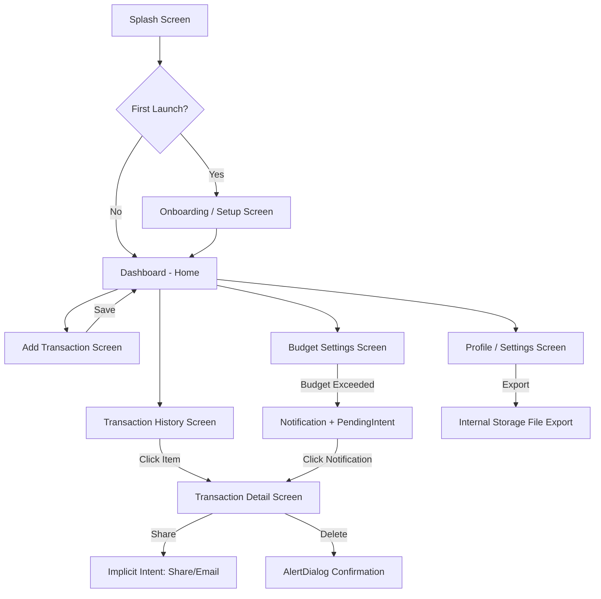

# 📄 Product Requirements Document (PRD)
# **FinanceFlow — Personal Finance Tracker App**

---

## 1. Overview

| Field | Detail |
|-------|--------|
| **App Name** | FinanceFlow |
| **Platform** | Android (Java) |
| **Min SDK** | 24 (Android 7.0) |
| **Target SDK** | 36 |
| **Package** | `com.example.project` |
| **Purpose** | A personal finance tracker that helps users log income/expenses, categorize spending, set budgets, and view financial summaries |

---

## 2. Problem Statement

Students and young professionals often lack a simple, offline tool to track daily expenses and income. FinanceFlow provides an intuitive, offline-first Android app to log transactions, view spending patterns, and stay within budget — all without needing internet access.

---

## 3. Target Users

- College students managing pocket money / hostel expenses
- Young professionals tracking monthly budgets
- Anyone wanting a simple, no-login expense tracker

---

## 4. Concept-to-Practical Mapping

> [!IMPORTANT]
> Every feature is built using **only** concepts from the 8 SL-II practicals.

| Practical # | Concept | How It's Used in FinanceFlow |
|:-----------:|---------|------------------------------|
| **P1** | GUI Components, Fonts, Colors, Activity Lifecycle | Custom theme with colors & fonts across all screens. `onPause()`/`onResume()` lifecycle logging |
| **P2** | Nested LinearLayout, RelativeLayout, ConstraintLayout | Dashboard uses ConstraintLayout; Transaction list uses Nested LinearLayout; Category cards use RelativeLayout |
| **P3** | Event Handlers, Button Enable/Disable, Toast | "Add Transaction" button disabled until all fields are valid. Toast on successful transaction |
| **P4** | ConstraintLayout, Input Validation, Form Management | Add Transaction form with amount, description, category, date validation |
| **P5** | Explicit & Implicit Intents | Explicit: Navigate between activities. Implicit: Share expense report via WhatsApp/Email, Call a financial advisor |
| **P6** | RadioButtons, AlertDialog, Notifications, PendingIntent | Budget category selection (RadioButtons). "Are you sure?" delete confirmation (AlertDialog). Budget exceeded notification with PendingIntent |
| **P7** | SharedPreferences, Internal Storage | First-time onboarding skip. Save user preferences (currency, name). Export transaction summary to internal storage file |
| **P8** | SQLite Database (CRUD) | Store all transactions (INSERT, SELECT, UPDATE, DELETE). View all transactions. Filter by category |

---

## 5. App Architecture — Screen Flow



---

## 6. Detailed Screen Specifications

### 6.1 — Splash Screen
| Aspect | Detail |
|--------|--------|
| **Layout** | ConstraintLayout |
| **Practical** | P1 (Lifecycle), P2 (Layout) |
| **Behavior** | Shows app logo + name for 2 seconds, then checks SharedPreferences for first launch |
| **Lifecycle Demo** | Log `onCreate()`, `onStart()`, `onResume()` in Logcat |

### 6.2 — Onboarding / Setup Screen (First Launch Only)
| Aspect | Detail |
|--------|--------|
| **Layout** | LinearLayout (Nested) |
| **Practical** | P7 (SharedPreferences) |
| **Fields** | User Name (EditText), Monthly Budget (EditText), Currency preference (Spinner: ₹, $, €) |
| **Behavior** | On "Get Started" click → save to SharedPreferences → never show again on next launch |
| **Validation** | Name and budget must not be empty |

### 6.3 — Dashboard (Home Screen) — `MainActivity`
| Aspect | Detail |
|--------|--------|
| **Layout** | ConstraintLayout (outer) + Nested LinearLayout (summary cards) |
| **Practical** | P1, P2, P3 |
| **Components** | |
| | **Header**: Welcome message with user name (from SharedPrefs) |
| | **Summary Cards**: Total Income (green), Total Expense (red), Balance (blue) — using RelativeLayout inside each card |
| | **Recent Transactions**: Last 5 transactions in a LinearLayout list |
| | **FAB / Add Button**: Floating action button → opens Add Transaction |
| | **Bottom Navigation**: Home, History, Budget, Settings (4 buttons in horizontal LinearLayout) |
| **Data Source** | Query SQLite for totals and recent records |

### 6.4 — Add Transaction Screen
| Aspect | Detail |
|--------|--------|
| **Layout** | ConstraintLayout |
| **Practical** | P3 (Event Handlers), P4 (Validation), P6 (RadioButtons) |
| **Fields** | |
| | **Amount** — EditText (number), must be > 0 |
| | **Description** — EditText, must not be empty |
| | **Type** — RadioGroup: Income / Expense |
| | **Category** — Spinner (Food, Transport, Shopping, Bills, Salary, Freelance, Other) |
| | **Date** — DatePicker (default: today) |
| **"Save" Button** | Initially **disabled**. Enabled only when ALL fields are valid (P3 — Event Handler) |
| **On Save** | INSERT into SQLite (P8). Show Toast "Transaction saved!" (P3). Check if budget exceeded → send Notification (P6). Finish activity → return to Dashboard |

### 6.5 — Transaction History Screen
| Aspect | Detail |
|--------|--------|
| **Layout** | ConstraintLayout + LinearLayout (scrollable list) |
| **Practical** | P2 (Layouts), P8 (SQLite SELECT) |
| **Components** | |
| | **Filter bar**: Spinner to filter by category (All, Food, Transport, etc.) |
| | **Transaction list**: Each row shows icon, description, amount (+green / -red), date |
| | **Click on row** → Explicit Intent to Transaction Detail (P5) |
| **Data Source** | `SELECT * FROM transactions ORDER BY date DESC` with optional `WHERE category = ?` |

### 6.6 — Transaction Detail Screen
| Aspect | Detail |
|--------|--------|
| **Layout** | ConstraintLayout |
| **Practical** | P5 (Intents), P6 (AlertDialog) |
| **Display** | Full details: Amount, Type, Category, Description, Date |
| **Actions** | |
| | **Share Button** → Implicit Intent: `ACTION_SEND` — share transaction as text via WhatsApp/Email (P5) |
| | **Delete Button** → AlertDialog: "Are you sure you want to delete this transaction?" with Yes/Cancel (P6). On Yes → DELETE from SQLite (P8), Toast "Deleted", finish() |
| | **Call Advisor** → Implicit Intent: `ACTION_DIAL` with a phone number (P5) |

### 6.7 — Budget Settings Screen
| Aspect | Detail |
|--------|--------|
| **Layout** | Nested LinearLayout |
| **Practical** | P4 (Validation), P6 (Notification), P7 (SharedPreferences) |
| **Fields** | Monthly Budget (EditText), Budget alert threshold (Spinner: 50%, 75%, 90%) |
| **"Update Budget" Button** | Validates input → saves to SharedPreferences |
| **Budget Alert Logic** | After every new expense, check: if `totalExpenses >= budget * threshold` → send Notification "⚠️ You've used X% of your budget!" with PendingIntent that opens Dashboard (P6) |

### 6.8 — Profile / Settings Screen
| Aspect | Detail |
|--------|--------|
| **Layout** | LinearLayout |
| **Practical** | P7 (SharedPreferences, Internal Storage), P5 (Implicit Intent) |
| **Components** | |
| | **User Name** (editable, saved to SharedPrefs) |
| | **Currency** (Spinner, saved to SharedPrefs) |
| | **Export Report Button** → Writes all transactions to a `.txt` file in internal storage (P7). Toast: "Report exported!" |
| | **Share Report** → Implicit Intent: Share the exported file summary via email (P5) |
| | **Reset All Data** → AlertDialog confirmation → Clear SQLite + SharedPrefs (P6, P7, P8) |

---

## 7. Database Schema (SQLite — P8)

### Table: `transactions`

| Column | Type | Constraints |
|--------|------|-------------|
| `_id` | INTEGER | PRIMARY KEY AUTOINCREMENT |
| `amount` | REAL | NOT NULL |
| `type` | TEXT | NOT NULL ("Income" or "Expense") |
| `category` | TEXT | NOT NULL |
| `description` | TEXT | NOT NULL |
| `date` | TEXT | NOT NULL (format: yyyy-MM-dd) |

### Key Queries
```sql
-- Insert new transaction
INSERT INTO transactions (amount, type, category, description, date) VALUES (?, ?, ?, ?, ?);

-- Get all transactions (newest first)
SELECT * FROM transactions ORDER BY date DESC;

-- Filter by category
SELECT * FROM transactions WHERE category = ? ORDER BY date DESC;

-- Get total income
SELECT SUM(amount) FROM transactions WHERE type = 'Income';

-- Get total expenses
SELECT SUM(amount) FROM transactions WHERE type = 'Expense';

-- Delete a transaction
DELETE FROM transactions WHERE _id = ?;
```

---

## 8. SharedPreferences Keys (P7)

| Key | Type | Purpose |
|-----|------|---------|
| `is_first_launch` | boolean | Skip onboarding after first setup |
| `user_name` | String | Display on dashboard header |
| `monthly_budget` | float | Budget limit |
| `currency` | String | ₹, $, or € |
| `budget_threshold` | int | Alert at 50%, 75%, or 90% |

---

## 9. File Structure (Java Classes)

```
com.example.project/
├── SplashActivity.java          — Splash + lifecycle demo
├── OnboardingActivity.java      — First-time setup (SharedPrefs)
├── MainActivity.java            — Dashboard (Home)
├── AddTransactionActivity.java  — Add income/expense form
├── HistoryActivity.java         — Transaction list with filters
├── TransactionDetailActivity.java — View/Share/Delete a transaction
├── BudgetActivity.java          — Budget settings
├── SettingsActivity.java        — Profile, export, reset
├── DatabaseHelper.java          — SQLite helper (CRUD operations)
└── Transaction.java             — Model class
```

---

## 10. Layout Files (XML)

```
res/layout/
├── activity_splash.xml
├── activity_onboarding.xml
├── activity_main.xml            — Dashboard
├── activity_add_transaction.xml
├── activity_history.xml
├── item_transaction.xml         — Row layout for transaction list
├── activity_transaction_detail.xml
├── activity_budget.xml
└── activity_settings.xml
```

---

## 11. Color Palette & Theme

| Color | Hex | Usage |
|-------|-----|-------|
| Primary (Deep Teal) | `#00796B` | App bar, buttons, FAB |
| Primary Dark | `#004D40` | Status bar |
| Accent (Amber) | `#FFC107` | Highlights, selected states |
| Income Green | `#4CAF50` | Income amounts, income card |
| Expense Red | `#F44336` | Expense amounts, expense card |
| Balance Blue | `#2196F3` | Balance card |
| Background | `#F5F5F5` | Screen backgrounds |
| Card White | `#FFFFFF` | Card backgrounds |
| Text Primary | `#212121` | Main text |
| Text Secondary | `#757575` | Subtitles, hints |

---

## 12. Practical Coverage Checklist

| # | Practical Requirement | FinanceFlow Feature | ✅ |
|---|----------------------|--------------------|----|
| P1 | GUI, Fonts, Colors, Lifecycle | Custom theme, Splash lifecycle logging | ✅ |
| P2 | Nested Linear, Relative, Constraint Layout | Dashboard (all 3 layouts used) | ✅ |
| P3 | Event Handlers, Enable/Disable, Toast | Add Transaction form validation | ✅ |
| P4 | ConstraintLayout, Input Validation | Add Transaction + Budget form | ✅ |
| P5 | Explicit + Implicit Intents | Navigate between activities + Share/Call | ✅ |
| P6 | RadioButtons, AlertDialog, Notification, PendingIntent | Income/Expense toggle, Delete confirmation, Budget alert | ✅ |
| P7 | SharedPreferences + Internal Storage | Onboarding skip, Preferences, Export report | ✅ |
| P8 | SQLite CRUD | Transactions database | ✅ |

---

## 13. Implementation Priority

### Phase 1 — Core (Must Have)
1. Splash Screen with lifecycle logging
2. Onboarding with SharedPreferences
3. Dashboard with summary cards
4. Add Transaction with validation + SQLite INSERT
5. Transaction History with SQLite SELECT

### Phase 2 — Features (Should Have)
6. Transaction Detail with Share (Implicit Intent) + Delete (AlertDialog)
7. Budget Settings with Notification on overspend
8. Export report to internal storage

### Phase 3 — Polish (Nice to Have)
9. Settings / Profile screen
10. Category filtering in History
11. UI polish and animations

---

> [!TIP]
> **Total Screens: 8** | **Total Java Files: 10** | **Total Layout XMLs: 9**
> 
> This is a well-scoped project that covers every single practical concept while being genuinely useful.

---

**Ready to start building? Confirm this PRD and I'll begin coding Phase 1.** 🚀
